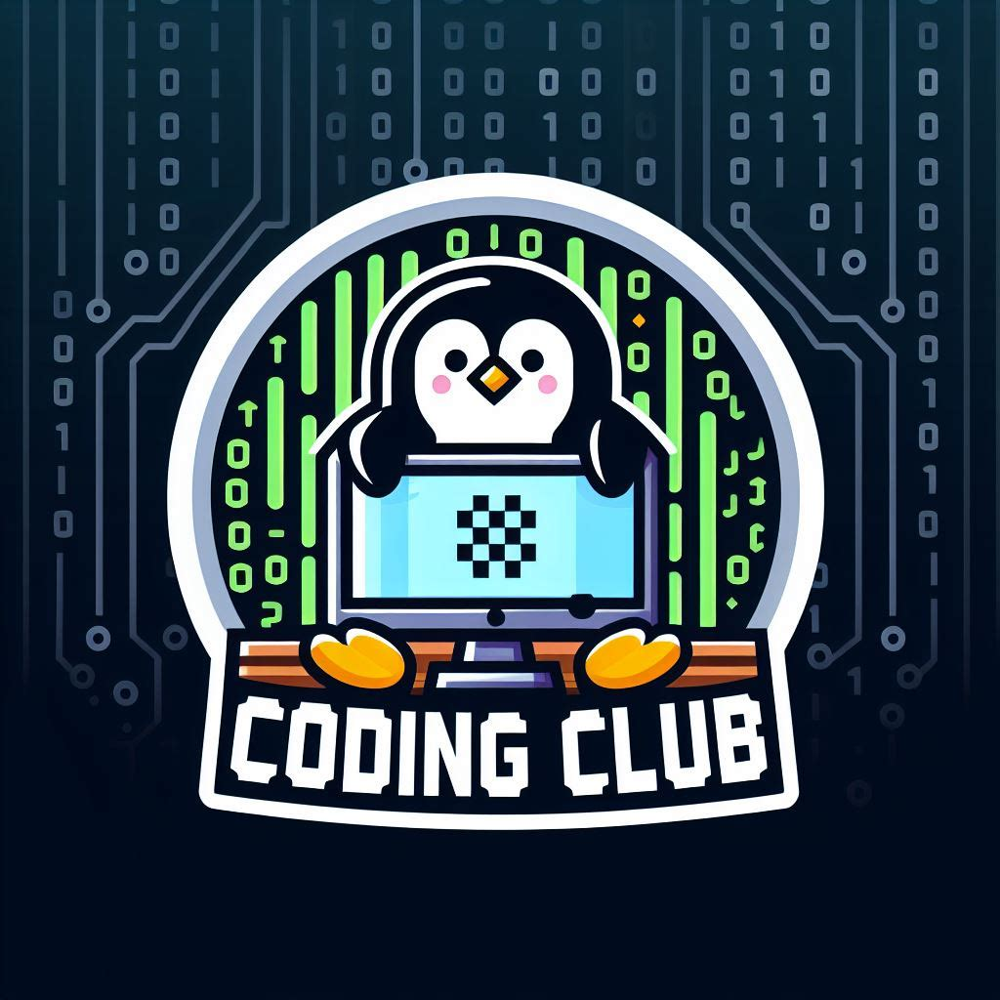
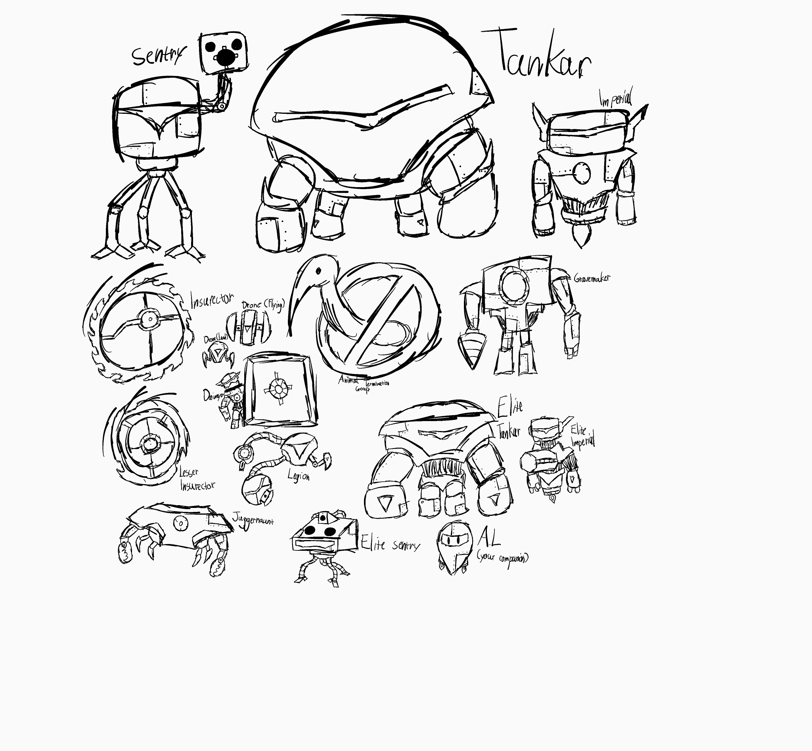
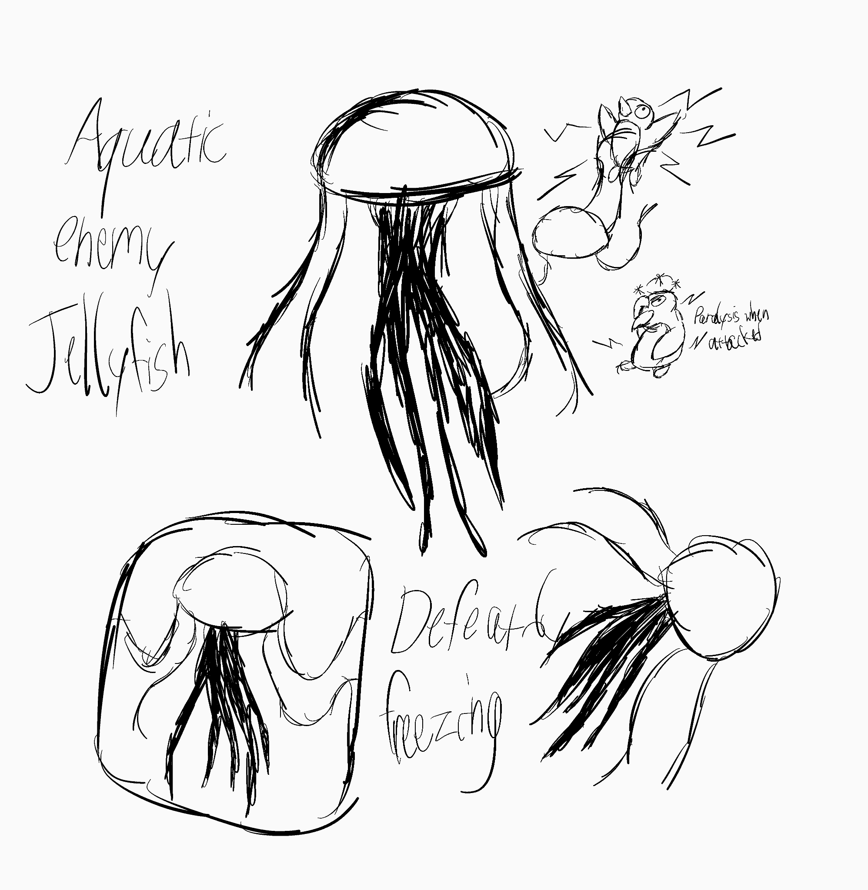
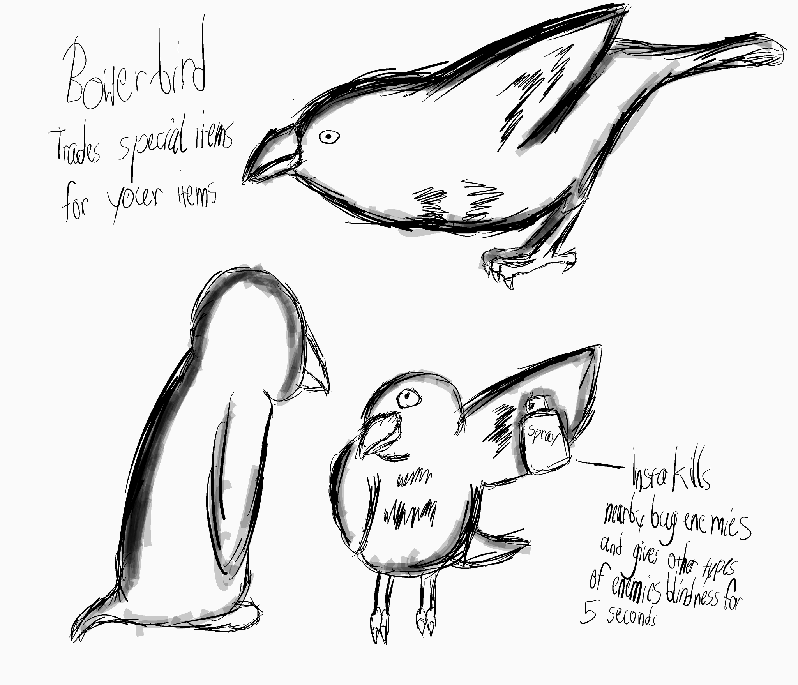

<!-- Place this tag where you want the button to render. -->
<a class="github-button" href="https://github.com/henley-high-school/pew-pew-penguino" data-color-scheme="no-preference: light; light: light; dark: dark;" data-icon="octicon-star" data-size="large" data-show-count="true" aria-label="Star henley-high-school/pew-pew-penguino on GitHub">Star</a> <!-- Place this tag where you want the button to render. -->
<a class="github-button" href="https://github.com/henley-high-school" data-color-scheme="no-preference: light; light: light; dark: dark;" data-size="large" aria-label="Follow @henley-high-school on GitHub">Follow @henley-high-school</a>
# Pew Pew Penguino Offical Home
# You found the offical website for Pew Pew Penguino!
## Have a look to see what we've done via our blogs or browse around the place and visit things like our newsltter or the repository.
<a href="https://penguinogame.me/aboutus">
  <button class="cayman-button">About Us</button>
</a>

<a href="https://penguinogame.me/blog">
  <button class="cayman-button">Blogs</button>
</a>

<a href="https://penguinogame.me/badge">
  <button class="cayman-button">Digital Badges</button>
</a>

<a href="https://penguinogame.me/art">
  <button class="cayman-button">More Art</button>
</a>

<a href="https://penguinogame.me/quiz">
  <button class="cayman-button">Penguino Game Quiz</button>
</a>

Thanks for visiting our website! Do you mind filling in a quick survey?

<a href="https://tally.so/r/3E0YqB">
  <button class="cayman-button">Sure! Why not?</button>
</a>

<iframe src="https://embeds.beehiiv.com/54543288-6f1a-431e-ada3-93dba7f3c8bc" data-test-id="beehiiv-embed" width="480" height="320" frameborder="0" scrolling="no" style="border-radius: 4px; border: 2px solid #e5e7eb; margin: 0; background-color: transparent;"></iframe>
P.S The newsletter comes out bi-weekly (Every 2 weeks).
## Here's some pictures of whats been made so far!
<body>
    

        
    

</body>
<body>
    

        
    

</body>
<body>
    

        
    

</body>
<body>
    

        
    

</body>
